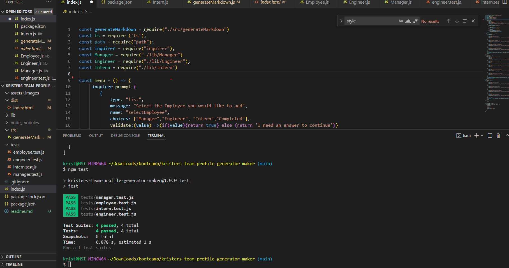

# Kristers Team Profile Generator Maker
      

  
  ## Description
The team profile generator shows some of my newly learned skills working with node.js, classes and tests. I have learned an introduction in how you can connect classes to different properties and push that information to a HTML file. I did not have enough time to finish it as much as I would like. I would have changed up the looks of it to make it a little more stylish. 
  
  ## Table of Contents
  * [Installation](#installation)
  * [Usage](#usage)
  * [Credits](#credits)
  * [License](#license)
  * [Contributing](#lontributing)
  * [Tests](#tests)
  * [Questions](#questions)

  ## Installation
  Download and install folder, install node and run node index.js in the integrated terminal
  Github Repository: https://github.com/kristermyr/kristers-team-profile-generator-maker

  ## Usage
  
  Walkthough: https://youtu.be/9Xg1zdqCyYY

  ## Dependencies
  FS, Inquirer and Jest
  ## Credits

  BCS Learning Assistant 

  Youtube:
  * https://www.youtube.com/watch?v=q0_egGq6hzE&t=114s&ab_channel=AustinCuddeback
  * https://www.youtube.com/watch?v=Rnv2ZL6jPqs&t=4s&ab_channel=jhf1203
  * https://www.youtube.com/watch?v=9YivEQFpmHQ&t=608s&ab_channel=DopeDev
  
  Github:
  * https://github.com/nicolewallace09/team-profile-generator
  * https://github.com/JamesLJenks/10_OOP-Team-Profile-Generator
  * https://github.com/JamesLJenks/10_OOP-Team-Profile-Generator/blob/master/output/team.html
  * https://github.com/jfisher396/team-profile-generator 
  * https://github.com/nicolewallace09/team-profile-generator/blob/master/index.js
  * https://github.com/TayHern/Team-Profile/blob/main/lib/Manager.js

  Collaborators:
  * Dylan Quaale - https://github.com/dylanquaale/EngineerTeam-Generator

  ## License
  MIT
  ## Contributing
  Create a new branch and submit a pull request
  ## Tests
  Jest - Employee, Engineer, Intern and Manager
  ## Questions
  Github Username: kristermyr
  Please send me an E-mail if you have any questions [here](mailto:krister90@gmail.com) or visit https://github.com/kristermyr

